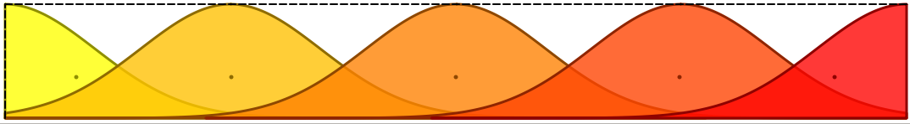
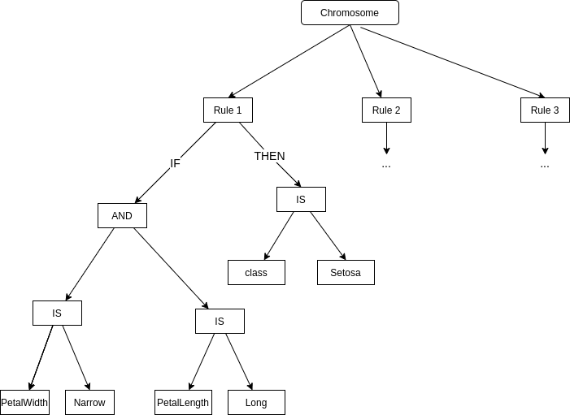
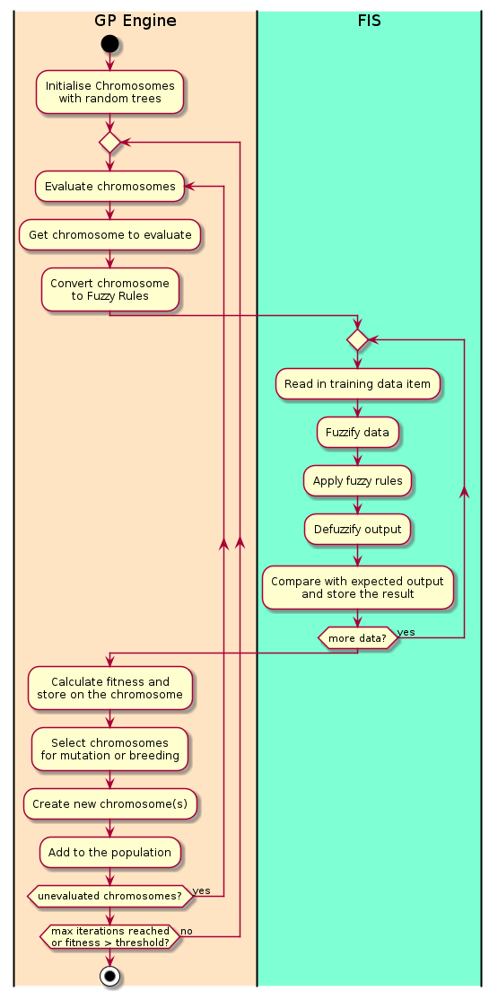

% Evolving Fuzzy Forests: creating fuzzy inference systems with Genetic Programming
% David Kirby,  Birkbeck College, University Of London
% Spring Term 2021

# Academic Declaration
This report is substantially the result of my own work, expressed in my own words, except where explicitly
indicated in the text. I have read and understood the sections on plagiarism in the Programme Handbook
and the College web site. I give my permission for it to be submitted to the JISC Plagiarism Detection Service.

The report may be freely copied and distributed provided the source is explicitly acknowledged.

# Abstract

Fuzzy inference systems are AI systems combining fuzzy set theory developed by Lofti Zadeh [@Zadeh-Fuzzy-1965] with IF-THEN rules to model some aspect of the real world.  They have been used for feedback control systems, classification and expert systems.  Fuzzy rules are explainable and comprehensible to laymen, but can be difficult to create and tune by hand.  

This project will implement an algorithm and python library for learning fuzzy rule systems from data through genetic programming techniques.  The algorithm and generated fuzzy rules will be evaluated against classification tasks and simple reinforcement learning applications and its strengths and weaknesses explored.  

# Introduction

In "The Master Algorithm" [@Domingos15], Pedro Domingos' non-technical introduction to machine learning for the general public, he describes the field of machine learning as being split into five tribes:  

 * the symbolists focus on finding symbolic rules to describe the world
 * the connectionists try to emulate the working of the brain with neural networks
 * the evolutionaries try to emulate the process of evolution
 * the bayesians see everything as conditional probabilities
 * the analogizers try to find similarities between things

According to Domingos, each tribe focuses on its own set of problems and has developed algorithms to solve them.  He goes on to hypothesise that a truely useful intelligent system - the Master Algorithm - must come from a synthesis of all of these approaches.

Despite Domingos' characterisation of separate tribes with little overlap, there is a long history of research in combining two or more of these disciplines.  This project aims to explore one of them - learning fuzzy rule systems from data through evolutionary techniques such as genetic algorithms and genetic programming.

# History and Prior Work

## Fuzzy Inference Systems

In traditional boolean logic something is either true or it isn't, an element is either member of a set or is not a member of the set. In 1965 Lofti Zadeh[@Zadeh-Fuzzy-1965] introduced the concept of fuzzy logic and fuzzy sets, where there could be degrees of truth between totally untrue and totally true.  In some ways this maps to the way people think about the world, for example it is true that a man who is six foot tall (183cm) belongs to the set of tall men, but it is more true that a man who seven feet tall (213cm) belongs to the set.  Fuzzy set theory assigns a membership function to the set, giving a membership value ranging from 0 (completely not a member) to 1 (completely a member).  A continuous variable such as height can be mapped to several overlapping fuzzy sets, e.g. "short", "average" , "tall" and the set membership functions can be combined with the fuzzy equivalent of standard boolean and set operators - AND, OR, NOT, UNION, INTERSECTION etc.  The membership functions are often triangular or trapezoidal, but other shapes can be chosen such as gaussian or sigmoid.  The membership functions can be further modified with linguistic modifiers called hedges, for example "very", "slightly", "extremely".  These map to functions that are applied to modify the membership function.

Figures 1 and 2 show triangle and gaussian fuzzy membership, (screenshots taken from the qtfuzzylite program[@fuzzylite]).

\
*Figure 1: Triangular fuzzy membership functions*

\
*Figure 2: Gaussian fuzzy membership functions*

The fuzzy sets can be composed into fuzzy rules that take a set of inputs and generates one or more outputs, e.g. 

for example, a set of fuzzy rules for classifying irises may include something like this: 

    IF petal-width IS very narrow AND petal-length IS short 
        THEN iris is setosa
    IF petal-width IS wide AND petal-length IS long 
        THEN iris is virginica
    IF petal-width IS NOT very wide 
      AND (petal-length IS fairly long OR sepal-width is narrow) 
      THEN iris is versicolor
    etc.

A Fuzzy Inference System (FIS) is a rule engine for prediction and control.  A FIS consists of several components:

* a fuzzifier that takes input values and converts them to fuzzy set memberships
* a database of rules
* an inference engine that applies the rules and generates fuzzy output values
* a defuzzifier that converts the fuzzy output to useable values or predictions

FIS are widely used in feedback control systems such as industrial plants.  They can also be used for classification but are not as widely known or applied in the machine learning community.

The main advantages of FIS are:

* explainability - the rules are readable as plain english so can be understood by non-experts  
* performance - evaluating even a large set of fuzzy rules can be very fast, often in the order of milliseconds

The disadvantages are that writing and tuning the set of fuzzy rules by hand can be laborious and time consuming.  

## Evolutionary Computation and Genetic Programming

The idea of using evolution to solve computer problems is almost as old as computing itself.  In his 1950 paper that introduced what is now called the Turing Test [@oai:cogprints.soton.ac.uk:499],  Alan Turing speculated about ways that machine intelligence might be implemented, and on of the approaches he saw as having potential was using evolutionary principles.   Although some work was done on simulating evolution in the 1950s and 1960s, the field really took off with the introduction of Genetic Algorithms (GA) by John Holland in the early 1970s [@Holland:1975].  Genetic Algorithms are way of searching a high dimensional space and consist of:

* a population of chromosomes - these are strings that encode the search space in some way
* a fitness function that is applied to a chromosome to find out how well it fits the search criteria
* a mutation operation that can randomly modify part of a chromosome
* a crossover operation that can combine parts of two chromosomes to create a new chromosome
* a selection operation to randomly select chromosomes from the population to be mutated or bred.  The selection algorithm is biased to pick chromosomes with a higher fitness function more frequently.

The algorithm repeatedly selects chromosomes from the population to mutate or breed and create new chromosomes.  Less fit chromosomes are removed and so over many generations the population evolves in the direction of maximising the fitness of the members.  

In the original formulation of GAs given by Holland the chromosomes were treated as purely binary strings and the mutation operation consisted of flipping a single bit while the crossover operation selected two bit positions at random and swapped over the bits between them.  Since then many variations have arisen with different names.  Some represent the chromosome as a string of floats or integers instead of bits, some only use mutation, some only use crossover, and so on.  These varieties all go under the umbrella term of Evolutionary Computing.  

One limitation of these approaches is the need to encode the problem to be solved as a linear and often fixed length string.  In the 1990s John Koza introduced Genetic Programming (GP) [@Koza92geneticprogramming] which represented the chromosome as a tree, which allowed much more complex systems to be modelled such as computer programs and electric circuits.  In GP a mutation is done by replacing a random subtree completely while crossover is done by selected a random subtree from each parent and swapping them.  

Today evolutionary computation in its various forms is used in a wide variety of optimisation problems, from designing buildings and antennas to optimising SQL queries.

## Hybrid Systems and Soft Computing

In 1992 Lofti Zadeh coined the term "Soft Computing" for the confluence of fuzzy logic, neural networks, evolutionary computing and probabilistic reasoning [@Zadeh1994FuzzyLN].  Contrary to Domingos' characterisations of separate tribes, in the intervening decades there has been a lot of research on combining two or more of these technologies.  For example:

**Neuro-fuzzy systems** are a combination of fuzzy logic and neural networks.  For example ANFIS (Adaptive Neuro-Fuzzy Inference System) [@Jang1993ANFISAF] is an architecture that maps the stages of a FIS to the layers of a neural network.

**Neuro-evolution systems** combine neural networks with evolutionary computation techniques, for example as a way to train a neural network's weights without using backpropagation.  This is useful in situation such as reinforcement learning where the gradient cannot be easily determined.  NEAT (Neuroevolution of Augmented Topologies) [@Stanley2002EfficientEO] takes this a step further and evolves the network topology, starting with a minimal network (just an input and output layer, no hidden layers) and adding nodes as needed.  This enables very efficient, minimalist network topologies to evolve to solve the problem at hand.

**Genetic Fuzzy Systems** (GFS) apply evolutionary computing techniques to fuzzy inference systems.  Evolutionary computing has been applied in several ways for creating and tuning fuzzy inference systems - [@Cordn2004TenYO] gives a good overview of the field.  One way EC has been used is in tuning the shape and location of the fuzzy membership functions of the input variables.  Another application of GAs to FIS is to evolve the fuzzy rules.  There are three main approaches to this:

* The Michigan approach encodes each rule as a chromosome and the set of rules becomes the population, so each rule is evaluated independently of the others and its fitness function depends on how much it contributes to the overall success of the rule set.
* The Pittsburgh approach encodes the entire rule set as a single chromosome and has a population of competing rule sets.  
* The Iterative Rule Learning (IRL) approach combines aspects of the Michigan and Pittsburgh approaches.  Each chromosome encodes a single rule as in the Michegan approach, but the rule set is run multiple times to select the best set of rules.

Genetically created fuzzy rule systems will often generate redundant or conflicting rules, so many system include a pruning step where these rules are removed.

For an indication of what a GFS can accomplish, [@Ernest2016GeneticFB] describes a AI named ALPHA for controlling unmanned combat drones in aerial combat.  ALPHA consists of a tree of Fuzzy Inference Systems trained through genetic algorithms to control a flight of drones in simulated combat. After being trained against an earlier AI system called AFRL it was tested in simulated combat against an experienced fighter pilot.  The paper goes on to say:

> "ALPHA was assessed by Colonel (retired) Gene “Geno”
  Lee. As a former United States Air Force Air Battle Manager, Geno
  is a United States Air Force Fighter Weapon School graduate and
  Adversary Tactics (Aggressor) Instructor, and has controlled or flown
  in thousands of air-to-air intercepts as a Ground Control Intercept
  officer, as a Mission Commander on AWACS, and in the cockpit of
  multiple fighter aircraft

> ...

> When Geno took manual control of the blue aircraft against
  the reds controlled by the baseline controller AFRL had previously
  been utilizing, he could easily defeat it. However, even after repeated
  attempts against the more mature version of ALPHA, not only could
  he not score a kill against it, he was shot out of the air by the reds every
  time after protracted engagements. He described ALPHA as “the most
  aggressive, responsive, dynamic and credible AI (he’s) seen-to-date.”"

# Project Objective

The objective of this project is to develop a machine learning library in python that generates a Fuzzy Inference System through genetic programming.  At a minimum the library should be usable for classification of datasets with a limited number of features and for simple reinforcement learning.  It will be evaluated against some benchmark problems such as:

* classification of the Iris dataset
* classification of the Titanic dataset
* cartpole balancing - this is a classic reinforcement learning problem frequently used as a benchmark for fuzzy and genetic systems, where a pole has to be kept balanced on a cart that the AI can move left and right. 
* two-pole cart - a much more difficult version where the AI has to balance two poles hinged together

Other reinforcement problems may be attempted if time permits.

Secondary objectives of the project are:

* explore alternative GFS implementations such as the Michigan and Pittsburgh approaches
* investigate ways of tuning the algorithm to improve performance
* investigate the trade-off between interpretability and precision in fuzzy rule systems - the more complex a set of fuzzy rules becomes, the less interpretable it become.

## Personal Objectives
My personal objectives in choosing this project are 

1. Getting hands-on experience with Genetic Programming and Fuzzy Logic.  I have had an interest in both subjects for many years but have not had the opportunity to apply the.
2. Getting hands-on experience with reinforcement learning.  Again this is something that I have been interested in for several years, but was not covered in this MSc course.
3. Try something different from deep neural networks.  Much of the ML world seems to be focused on the application of DNNs to everything these days, and I would like to try something different.  

# high level system architecture

The framework will be split into two subsystems, the Genetic Programming subsystem and the Fuzzy inference subsystem.   The architecture described here assumes a Pittsburgh system where each chromosome encodes an entire rule set.  Other architectures may be explored as part of the project if time permits. 

\
*Figure 3: System Diagram*

## Genetic Programming Subsystem
The GP subsystem is responsible for managing the evalutation of a population of chromosomes and evolving them to improve their fitness and has these components:

The **chromosome** is a representation of a set of fuzzy rules as a typed expression tree.  The set of fuzzy rules for classifying irises could be represented as shown in Figure 4.

Each chromosome will also hold a fitness value which is a measure of how well it performs against the training dataset.

\
*Figure 4: Expression tree for a chromosome*

The **population** is a holder for the current set of chromosomes.  The initial population is randomly generated.

The **Selection Strategy** chooses chromosomes in the population to be mutated, bred, or removed according to their relative fitness values.  There are several strategies that are used in GA and GP systems such as selecting individuals for breeding with a probability proportional to their fitness (roulette wheel selection).  Another is to select a small number at random and cross-breed the two fittest members to replace the least fittest (tournament selection).

The **Crossover Strategy** is responsible for breeding two selected chromosomes to create a new pair.  This is done by randomly selecting a subtree in each chromosome and swapping them over.  Since the chromosomes are typed trees, the second subtree root node must match the type of the first subtree root node to ensure that the resulting chromosomes are syntactically correct.  

The **Mutation Strategy** modifies a single chromosome selected by the selection strategy by picking a random node in the tree and generating a new random subtree.  

The **GP Engine** is the top level controller and manages the overall evaluate-evolve loop.

The **Fitness Function** is the interface between the GP Subsystem and Fuzzy Inference System.  It is responsible for:

* converting a chromosome into a representation of fuzzy rules that the FIS can understand
* calling on the FIS to run the rules against the training data
* evaluating how well the rules performed against the training data and assigning a fitness value to the chromosome.

## Fuzzy Inference Subsystem
The FIS is responsible for running a set of fuzzy rules against a dataset and has these components:

The **Fuzzy Rules** are generated from the tree representation in a chromosome.

The **Fuzzy Rulebase** is the collection of fuzzy rules generated from a chromosome.  

The **Fuzzifier** is responsible for taking input data and converting it to fuzzy set membership values using the Fuzzy Set Definitions.

The **Fuzzy Set Definitions** holds the information needed to convert an input feature value into a fuzzy set membership and to contain the shape and position of the membership functions for each feature.  This could be defined by the user as an input hyperparameter, or derived from and initial scan through the input data to get the minimum and maximum values and divide it into a pre-determined number of functions.  

The **Defuzzifier** converts the fuzzy output values back into crisp (non-fuzzy) values.  There are several algorithms used to do defuzzification such as Center Of Gravity or Mean Of Max.  The best defuzzifier may depend on the problem being tackled so the choice of defuzzifier may be left as a user-selectable hyperparameter or could be encoded in the chromosome and learnt along with the fuzzy rules.  
For some applications defuzzification may be unnecessary and the output left as fuzzy values.  For example for forecasting the weather "moderately cloudy with light rain" would be more informative than "cloudy YES/NO, rain YES/NO".  Another case where leaving the output values fuzzy would be for use as inputs to another fuzzy system, as in the ALPHA flight combat AI.

The **Fuzzy Logic Controller** manages the process of reading in data, fuzzifying it, applying the rules from the rulebase and defuzzifying the output.

## Flow of control
Figure 5 shows the overall process of training the population against some training data.  The GP system runs the outer loop of creating, updating and evaluating the population of chromosomes.   The FIS runs the inner loop of applying the fuzzy rules generated from the chromosomes against the training data and recording a score that can be used for evaluation.  

\
*Figure 5: UML Activity Diagram for the system*

# Tools and Languages
The primary programming language for the project will be Python 3.  Open source libraries will be used for the low level fuzzy logic and evolutionary computing and there are several candidates for both that will be evaluated.  The leading contenders are DEAP [@DEAP_JMLR2012] and fuzzylite [@fuzzylite].  OpenAI Gym [@brockman2016openai] will be used for the reinforcement learning environments.

## DEAP - Distributed Evolutionary Algorithms in Python

DEAP is a widely used python library for evolutionary computation.   It is a toolbox of components for building a wide range of optimisation and search algorithms based on the principles of evolution.  From the website:

> DEAP includes the following features:
> 
> * Genetic algorithm using any imaginable representation
>   * List, Array, Set, Dictionary, Tree, Numpy Array, etc.
> * Genetic programing using prefix trees
>   * Loosely typed, Strongly typed
>   * Automatically defined functions
> * Evolution strategies (including CMA-ES)
> * Multi-objective optimisation (NSGA-II, NSGA-III, SPEA2, MO-CMA-ES)
> * Co-evolution (cooperative and competitive) of multiple populations
> * Parallelization of the evaluations (and more)
> * Hall of Fame of the best individuals that lived in the population
> * Checkpoints that take snapshots of a system regularly
> * Benchmarks module containing most common test functions
> * Genealogy of an evolution (that is compatible with NetworkX)
> * Examples of alternative algorithms : Particle Swarm Optimization, Differential Evolution, Estimation of Distribution Algorithm

## Fuzzylite
Fuzzylite is fuzzy logic control library.  There are versions implemented in C++, Java and Python.  The python version will be used for this project, but once trained the fuzzy rules could be run using the C++ library in a production system for higher performance.  

There is also QTFuzzylite, a GUI for manually designing and exploring fuzzy rule sets.

From the website:

> The FuzzyLite Libraries have the following features:
> 
> * 6 Controllers: Mamdani, Takagi-Sugeno, Larsen, Tsukamoto, Inverse Tsukamoto, Hybrids
> * 21 Linguistic terms: 4 Basic: triangle, trapezoid, rectangle, discrete.
> * 9 Extended: bell, cosine, gaussian, gaussian product, pi-shape, sigmoid difference, sigmoid product, spike.
> * 5 Edges: binary, concave, ramp, sigmoid, s-shape, z-shape.
> * 3 Functions: constant, linear, function.
> * 7 Activation methods: general, proportional, threshold, first, last, lowest, highest.
> * 8 Conjunction and Implication (T-Norms): minimum, algebraic product, bounded difference, drastic product, einstein product, hamacher product, nilpotent minimum, function.
> * 10 Disjunction and Aggregation (S-Norms): maximum, algebraic sum, bounded sum, drastic sum, einstein sum, hamacher sum, nilpotent maximum, normalized sum, unbounded sum, function.
> * 7 Defuzzifiers: 5 Integral: centroid, bisector, smallest of maximum, largest of maximum, mean of maximum.
> * 2 Weighted: weighted average, weighted sum.
> * 7 Hedges: any, not, extremely, seldom, somewhat, very, function.
> * 3 Importers: FuzzyLite Language fll, Fuzzy Inference System fis, Fuzzy Control Language fcl.
> * 7 Exporters: C++, Java, FuzzyLite Language fll, FuzzyLite Dataset fld, R script, Fuzzy Inference System fis, Fuzzy Control Language fcl.

## openAI Gym
For reinforcement learning I will use openAI Gym, an open platform with an extensive range of environments for experimenting with RL agent.  The provided environments include classic control problems such as cartpole as well as robotics simulations and Atari games.  Because it provides a standard interface for reinforcement learning environments a large number of third party environments have been created for it.  

# Methodology and Work Plan
## Development methodology
During development the principles of the Agile Manifesto [@beck2001agile] will be followed.  As far as possible, the techniques of Test Driven Development (TDD) and Behaviour Driven Development (BDD) will be followed.  However it is recognised that this is not always possible to write tests in advance for machine learning algorithms since the output cannot always be known before the code is written.  

The code will be written in an iterative and incremental fashion and the design will be expected to evolve as the project progresses - the architecture described in section 6 is a starting point, not an end point.  Rather than planning out the schedule in detail, the work will be split into stories and their sizes estimated in story points using a Fibonacci numbering system.  By tracking how long stories take to implement the project velocity can be measured to ensure it is on track to be completed on time.   Since I am working alone to an irregular schedule the Kanban method will be used where stories are worked on in priority order from a backlog, rather than fixed length iterations where the stories for each iteration are planned at the start of the iteration.

## Initial Stories
Here is an initial breakdown of the stories and their estimates in story points.  As work progresses these are likely to be broken down into finer grained stories and new stories added as needed.  

### Implement Fuzzy Inference System for classification  (8 points) {-}
The FIS should be able to read in data from a dataframe or numpy array, fuzzify the values, evaluate a set of fuzzy rules against the data and defuzzify the output to make a prediction of the target class. 

### Implement chromosomes (8 points) {-}
Create the node types for the chromosome expression tree and implement the conversion from expression tree to fuzzy logic rules that can be used by the FIS.

### Implement fitness evaluator for classification (3 points) {-}
This will invoke the FIS with rules generated from a chromosome, run it against a data set and evaluate the classification performance.

### Implement the Genetic Programming Engine (5 points) {-}
the Genetic Programming Engine will handle generating, evaluating and evolving the chromosomes.

### Extend the Fuzzy Inference System for reinforcement learning (5 points) {-}
The FIS will probably need adapting to fit into the openAI Gym framework.  In particular it is anticipated that the fuzzification and defuzzification stages will need to be modified to be compatible with the Gym interface.

### Extend the fitness evaluator for reinforcement learning (5 points) {-}
Like the FIS, the fitness function for evaluating chromosomes will need to be adapted for the reinforcement learning environment.

### Experimentation and parameter tuning (13 points) {-}
Both fuzzy logic systems and genetic programming systems have a large number of hyperparameters that can be adjusted to try and improve the system performance.  For the FIS this can include the type and number of fuzzy sets that the input values are converted into and the type of defuzzification that is used.  For the GP system this can include the population size, the selection strategies and probabilities when choosing chromosomes for mutation or breeding, whether to replace chromosomes in the existing population or create a new population each generation, whether to always keep top performing chromosomes between generations etc.  

The tuning phase is effectively open-ended since there are always more things to try, so for this project it will need to be timeboxed to the available time remaining.

### Project Report (13 points) {-}
Time will need to be allocated to writing the final report.  It is anticipated that parts of the report will be written as it is being implemented, but that will still take time and more time will be needed at the end of the project to finish it.

# Bibliography
