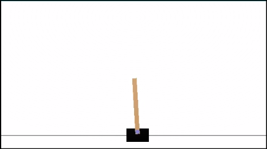
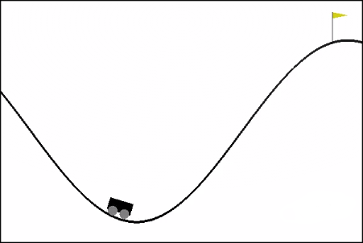
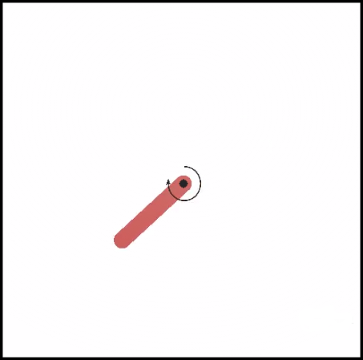

# List of Figures and Tables

\newpage
# Introduction

There have been a large number of machine learning algorithms developed over the last few decades and combined with the increase in computing power and availability of large volumes of data they have transformed many areas of our lives.   However their use in some areas such as law, medicine or finance is held back because most of the models are unable to explain how they came to a decision and are effectively black boxes.  

One solution to this problem is to have a machine learning algorithm defined as a set of fuzzy IF-THEN rules that can then be represented in a form understandable to non-specialists.  Fuzzy rules were originally hand written for expert systems but writing and debugging rules by hand is time consuming and error prone.  An alternative it to learn the fuzzy rules from data.  Several ways of doing this have been developed, one of the most successful being through the application of genetic programming (GP).


## Background
### Fuzzy Sets and Fuzzy Inference Systems
People have no problem dealing on a daily basis with fuzzy and imprecise terms and reasoning about them.  For example "light rain", "heavy rain" and "downpour" have no precise definition and there is no exact point where a change in precipitation moves from one category to another, but people understand and generally agree on what the terms mean.    In 1965 Lofti Zadeh [@Zadeh-Fuzzy-1965] introduced fuzzy logic and fuzzy set theory, which allowed for representing and reasoning about the sets using the kind of imprecise terms used in human language.  Zadeh showed that you could represent these kinds of fuzzy sets by a membership function that maps how strongly an item belongs to the set into a real value between 0 and 1.  Ten years later [@zadehConceptLinguisticVariable1975] he added the idea of mapping fuzzy membership functions to linguistic variables.  For example in english we refer to people as being "short", "average", "tall", "very tall" and so on.  These can be modelled by mapping a linear value (a person's height) to one or more fuzzy sets.  A person can have degrees of membership to several "height" sets, ranging from 0 (not a member of this set) to 1 (a full member of the set).  So a person who is a little above average height may have a membership of 0.8 to the "average height" class and 0.1 to the "tall" class.  Unlike probabilities the membership values do not need to sum to 1 and in most cases will not.  The usual boolean set operators such as AND, OR, UNION, INTERSECTION and NOT can be expressed as mathematical functions on the membership functions.  

Figure 1 shows how a person's height could map onto linguistic variables using triangular mapping functions.  Other shapes than triangles can also be used, such as gaussian or trapezoid.


*Figure 1: fuzzy membership functions for adult human height*

A fuzzy inference system (FIS) uses a set of rules composed of fuzzy sets to map one or more inputs into output values.  For example, a potential set of fuzzy rules for the classification of irises could be:

    IF petal-length IS long AND  petal-width IS wide
        THEN virginica is likely
    IF NOT petal-width IS wide 
      AND (sepal-width is narrow OR petal-length IS long) 
      THEN versicolor is likely
    IF petal-width IS narrow AND petal-length IS short 
        THEN setosa is likely
    etc.


Fuzzy inference systems are commonly used for feedback control systems but can also be used for other purposes, such as classification.  Because the rules are expressed in terms of linguistic variables they can be easy for humans to understand.  However writing rules manually is slow and error prone, so a better approach is to learn the rules from the data.  


### Genetic Programming

Genetic programming (GP) is part of a family of algorithms inspired by the process of natural evolution,  known collectively as Evolutionary Computing (EC).   These algorithms include genetic algorithms,  evolutionary strategies,  particle swarm optimisation,  differential evolution and many others.  All EC algorithms work by creating a population that randomly samples possible solutions in the problem space, then combines attributes of the best individuals to create a new population. They generally hold the following features in common and differ in implementation and emphasis:

-  codification of a potential solution to a problem into some data structure.  This  is often referred to as their chromosome or genotype
-  a population of individuals whose chromosomes are  initially randomly generated
 - a fitness function that evaluates an individual's chromosome To see how well it fits as a solution to the problem
- a method of selecting individuals from the population according to their fitness
- mutation -  the chromosome of a selected individual may be randomly modified
- crossover  or mating -  parts of the chromosomes of two selected individuals are swapped over to make new individuals

The evolutionary computing algorithms generally work as follows:
```
an initial population is randomly generated
for N generations:
    evaluate each individual's fitness

    randomly select individuals with a bias towards fitter individuals

    randomly leave them unchanged, mutated or mated with another selected individual 
        selected individuals are replaced by the offspring
```


Evolutionary computing algorithms have been applied to many problem domains, and are particularly useful for solving problems that are mathematically intractable, for example because the derivative cannot be calculated for back propagation or the problem is NP-complete.  They are also useful for multi-objective problems where they can find a set of solutions that are Pareto optimal.  

Most EC algorithms represent the chromosome as a fixed-length list of values.  For example Genetic Algorithms (GA) [@Holland:1975] represents the chromosome as a bit string, with mutation done by flipping a randomly selected bit and crossover done by swapping the bits of two individuals that are between random start and end points.   Evolutionary Strategy uses a list of floating point values for the chromosome and mutates by adding a value from a gaussian distribution, with crossover not being used at all.   Using a fixed length linear representation works for some problems, but there are limitations on what it can encode.

Genetic Programming [@Koza92geneticprogramming] avoids this limitation by encoding the chromosome as a tree that can vary in size as it evolves.  The tree is usually used to represent a computer program or mathematical expression, but it can also be used to represent other complex structures such as circuit diagrams [@DesignAnalogCircuits].  

To mutate a tree a random node is selected and the subtree from that node is replaced by a new randomly generated tree.  Crossover is done by selecting a random node in each parent and swapping them over to create two new individuals.   Figure 2 shows an example of two trees representing the expressions $sin(x+3)$ and $sqrt(log(y * 10))$.  After crossover the two offsprings represent the expressions $sin(x + log(y*10))$ and $sqrt(3)$.  


*Figure 2: Example of crossover in Genetic Programming*


# Project Objectives and Results Summary

## Objectives

The objective of the project was to implement a library for evolving fuzzy logic rules through Genetic Programming with application in two domains:

1. Classification of data sets

2. Reinforcement Learning with the OpenAI Gym RL platform.

A second objective was to explore how well the generated fuzzy Logic system performed for different tasks and investigate ways of improving its performance.

## Results Summary

All the objectives of the project were achieved.  The main entry points to the code are a class called FuzzyClassifier for classification of datasets and one called GymRunner to learn to play openAI Gym environments.


### FuzzyClassifier

A FuzzyClassifier class was created that could learn a set of fuzzy rules from a dataset that could then be used to predict the classification of unseen data.  It was implemented in the style of scikit-learn classifiers, with hyperparameters specified in the  `__init__` method, the  `fit` method trains the classifier and the `predict` method makes predictions.   

It was found that the classifier worked well on small data sets with two or three classes, but for large datasets the training time could be prohibitive and the accuracy was found to be poor when tried on a data set with seven classes.  However this could be an artifact of the particular dataset used since the No Free Lunch theorem [@wolpertNoFreeLunch1997] says that no algorithm is suitable for all data sets, so the poor performance could be an artifact of that particular dataset rather than the number of classes.  Further work would be needed to determine if it performs as badly on other multi-class problems.

A unique feature of the classifier is the ability to show the top performing rule set as human readable text.  For example on the Wisconsin breast cancer dataset, the following set of rules generated during 5-fold cross validation scored 94.8% accuracy in predicting benign and malignant outcomes on the test data:

```
IF NOT-Single_Epi_Cell_Size[low] THEN [malignant[likely], benign[unlikely]] 
IF Cell_Shape_Uniformity[low] THEN [malignant[likely], benign[likely]] 
IF Cell_Shape_Uniformity[very_low] THEN [benign[likely], malignant[unlikely]] 
IF Mitoses[high] THEN benign[unlikely] 
IF Bare_Nuclei[very_high] THEN benign[unlikely] 
IF Cell_Size_Uniformity[high] AND Single_Epi_Cell_Size[high] THEN malignant[unlikely]
```

### GymRunner 

A class called GymRunner was created that could learn to play some reinforcement learning environments in openAI Gym.  It was found to be able to master some simple environments such as cartpole (balancing a 2D pole on a moveable cart) in as few as ten generations.  For LunarLander, a more complex environment, it took several hundred generations to be able to repeatably get a good score.  A video demonstration of it playing LunarLander is available at https://youtu.be/Oo6hulwqr9M.

More information about the exploration of the FuzzyClassifier and GymRunner performance against different data sets and gym environments can be found in the Testing and Evaluation section later in this report, along with steps taken to improve the performance.

# Architecture and Design

## Third Party Libraries

The following third party libraries were chosen for use in the project:

### DEAP for genetic programming

DEAP [@DEAP_JMLR2012] is the defacto standard library for evolutionary computation in Python, supporting a wide range of algorithms such as Genetic Algorithms, Genetic Programming, Particle Swarm Optimisation, and Evolution Strategy.  Other evolutionary libraries that were investigated were found to be toy projects not intended for production use, did not support Genetic Programming, or were tailored to a specific application of GP such as symbolic regression.

DEAP is a toolbox of components for implementing evolutionary systems, rather than out-of-the-box ready made algorithms such as those provided by frameworks such as scikit-learn.  This makes the learning curve steeper, but gives great flexibility in the problems it can be applied to.  

The main components of DEAP are:

1. `deap.creator.create` function for creating new types.  This is used to define the custom classes used by the application, for example the type of an individual.

2. `deap.base.Toolbox` is used to register parameterised functions.  For example
   ```python
   toolbox = deap.base.Toolbox()
   toolbox.register("select", deap.tools.selTournament, tournsize=3)
   ```
   creates the attribute "select" on the Toolbox instance that is the `deap.tools.selTournament` function with its `tournsize` parameter bound to the value 3.  When the Toolbox instance is passed to the main evolution algorithm it will expect certain functions to be defined on the toolbox for it to call.  Other functions that need to be registered typically include "mate", "mutate" and "evaluate" as well as "select" but it depends on the algorithm being used.

3. A library of functions for different ways of mating, mutating and selecting individuals in the population and for running different kinds of evolution algorithms. Using the toolbox these can be combined like lego bricks to produce a huge variety of evolutionary computing solutions.
   
4. The Genetic Programming module.  This is the most complex part of DEAP and is explained in more detail in the next section.

#### The deap.gp module
The `deap.gp` module contains classes and functions for supporting Genetic Programming.  The core components are:

1. The `PrimitiveTree` class encapsulates the tree structure that the genetic programming operations act on.   The tree of primitives is stored in a python list in depth-first order.  Because the the arity of every primitive is known, the tree can be reconstructed from the list when it is compiled.  The `PrimitiveTree` class has methods for manipulating the tree and a `__str__` method converts the tree into the equivalent python code, to be used by the `compile` function. 

2. The `PrimitiveSet` and `TypedPrimitiveSet` classes are used to register the type of nodes that a go into a tree structure.  There are three types:
   
   - `Primitive`s are functions that take a fixed non-zero number of arguments and return a single result.  These form the non-leaf nodes of the tree.
   - `Terminal`s are either constants or functions with no arguments that form the leaves of the tree.  Terminals that are functions are executed every time the compiled tree is run.
   - `EphemeralConstant`s are Terminal functions that are executed once when they are first created and after that always return the same value.  These are used for example to generate a random value that is then used as a constant.
  
   A `PrimitiveSet` assumes that the parameter and return types of the primitives and terminals are compatible.   A `TypedPrimitiveSet` requires all the types to be defined when they are registered, and will only build trees where the parameter and return types match.

3. The `compile` function takes an individual tree of primitives and compiles it to a python function.   It does this by first converting it to a string containing a lambda function and then calling `eval` on the string.  Because the function is compiled from a string using `eval` it is necessary that all the primitives and terminals have `__repr__` methods that will result in that object being created when executed.

4. support functions for creating, mutating and mating trees of primitives.

Full documentation for DEAP can be found at https://deap.readthedocs.io/en/master/index.html.


### Scikit-fuzzy for the fuzzy inference system
Several python fuzzy logic libraries were evaluated for the low-level fuzzy inference engine implementation, including:

* fuzzylite python version - https://fuzzylite.com/; https://github.com/fuzzylite/pyfuzzylite
* fuzzylogic - https://github.com/amogorkon/fuzzylogic
* FuzzyLogicToolbox - https://github.com/Luferov/FuzzyLogicToolBox
* FuzzyPy - https://github.com/alsprogrammer/PythonFuzzyLogic
* Simpful - https://github.com/aresio/simpful
* fuzzylab - https://github.com/ITTcs/fuzzylab
* scikit-fuzzy - https://scikit-fuzzy.github.io/scikit-fuzzy/

Several of these were rejected because they were lacking in documentation or unit tests.  Others were rejected because they appeared to be abandoned with no commits for at least two years and in some cases requiring python 2.7 or earlier.

The library chosen was scikit-fuzzy [@warnerJDWarnerScikitfuzzyScikitFuzzy2019], for the following reasons:

* it has reasonable documentation (including docstrings) and unit tests
* it has been updated in the last six months, so is still in active development
* it supports rules having multiple output variables, for example the rule

  `IF NOT-petal_width[average] AND petal_length[long] THEN [setosa[unlikely], versicolor[unlikely]]`

  can set a fuzzy output value for both setosa and versicolor.  Most of the libraries would require this to be written as two rules.
* a rule in scikit-fuzzy is created using python operators "&", "|" and "~" on objects. Although this may be a drawback when creating rules by hand since it is less readable than the text-based approach used by many other libraries, it fits in well with the way that the DEAP gp module defines chromosomes as a tree of python functions and objects.  


Scikit-fuzzy has a low level API that provides functions for creating and manipulating fuzzy variables, and a high-level API that provides fuzzy rules and an inference engine that evaluate the rules against the user's data.   The high-level components of scikit-fuzzy are:

1. The `Antecedent` class represents an input fuzzy variable.  It is created with a name string and a "universe of discourse" - a numpy linspace array that defines the range of values it can take.
2. The  `Consequent` class represents an output fuzzy variable and is defined in the same way as an `Antecedent` with the addition of a defuzzification method.   Several defuzzification methods are available such as centroid, bisector and mean of maximum.
3. Once a fuzzy variable has been created it needs to have terms defined on it.  A term is a membership function over part of the universe of discourse.  The `Antecedent` and `Consequent` classes have an `automf` function that will automatically create overlapping triangular membership functions over the universe of discourse.  The user may provide a list of names for the terms, or default names may be used.  In the above example "petal_width" would be an `Antecedent` and the terms could be "very_narrow",  "narrow" "average", "wide", "very_wide".  Similarly "setosa" would be a `Consequent` with terms "likely" and "unlikely".
4. `Antecedent` terms can combined to create a new compound term using python operators "&", "|" and "~" on objects, for the AND, OR and NOT fuzzy operators.  
5. A `Rule` class is created with an `Antecedent` term expression and a list of `Consequent` instances.
  For example the above rule would be created with:
  ```python
  Rule(
      ~petal_width['average'] & petal_length['long'], 
      [setosa['unlikely'], versicolor['unlikely']]
  )
  ```
6. To run the Fuzzy Inference System a `ControlSystem` instance is created a with a list of rules, and a `ControlSystemSimulator` is created with the control system as a parameter.  The input data is passed into the `ControlSystemSimulator.input` method and `ControlSystemSimulator.calculate` is called.  The result for each consequent is then available in `ControlSystemSimulator.output["consequent-name"]`.  


### OpenAI Gym Reinforcement Learning Platform
Gym [@brockman2016openai] is a framework for reinforcement learning and a collection of environments for training RL agents.  It provides a simple and flexible API that agents can use to explore and interact with an environment.  The environments supported include classical control problems, 2D and 3D physics engines and classic Atari console video games.  It has become a standard platform for doing RL in python and a range of compatible third party environments are also available.  

The core parts of the API are:

1. The environments are registered with the gym and can be created by passing the environment name to the `gym.make` method, e.g.  `env = gym.make("CartPole-v1")`
2. the `env.observation_space` defines what an agent can "see" at each step and the `env.action_space` defines what an agent can do at each step.  An agent can interrogate these spaces to determine the range of possible inputs and outputs.
3. The `env.reset()` method set the environment to its initial state and returns an observation of that state. 
4. The `env.step(action)` takes an action provided by the agent and returns a tuple of `(observation, reward, done, info)`.  Where

  - `observation` is information about the updated state of the environment
  - `reward` is the reward (positive or negative) for taking that step
  - `done` is a boolean flag indicating if the run is completed
  - `info` may contain diagnostic information specific to an environment, and should not be used by the agent for learning
5. `env.render()` will display the current environment (e.g. one frame of an atari game) and can be used to create a video display of the agent in action.  This is usually omitted during training to speed up the process.

The `observation_space` and `action_space` are subclasses of `gym.spaces.Space` and will be one of several types.  The most common are:

1. `Discrete(n)` - the observation or action is a single integer in a range 0-n.
2. `Box(low, high, shape, dtype)` a numpy array of the given shape and dtype where the values are bounded by the high and low values.  This may be a simple linear array or multidimensional.  For example the atari games often have an observation space of `Box(low=0, high=255, shape=(210, 160, 3), dtype=np.uint8)`, where the Box is a 3-dimensional representation of the screen pixels.

Other types of observational space exist, such as dicts or tuples of spaces, but they are rarely used in practice.

### Other third party libraries
Other third-party libraries used are:

1. tensorboardX (https://tensorboardx.readthedocs.io/en/latest/tensorboard.html) is used to optionally write performance data in a format that can be displayed by TensorBoard (https://www.tensorflow.org/tensorboard/)

2. Numpy for general numerical and array manipulation

3. Pandas for handing classification on pandas dataframes.

3. scikit-learn in order to make the FuzzyClassifier class a compatible scikit-learn classifier.

## Design Overview

The code for the project is in a python package `evofuzzy` which contains four modules.

* fuzzygp.py has the low level functions for handling the genetic programming operations and the conversion between DEAP PrimitiveTree instances and scikit-fuzzy rules. The two main entry points are:
  * `register_primitiveset_and_creators` function creates a `TypedPrimitiveSet` initialised with all the primitives and registers it with a deap toolbox, along with functions for creating individuals and complete populations.
  * `ea_with_elitism_and_replacement` is the main evolve / evaluate loop, loosely based on the `eaSimple` function provided by DEAP.   It takes a population and a toolbox instance and will iterate for a fixed number of generations, evaluating each individual with the `toolbox.evaluate` function then mutating and mating them according to their fitness.  It also performs several other services including:
    * handling small batches of data for the classifier
    * parallelising the evaluation of the population members over multiple cores
    * recording statistics about the population, such as mean and best fitness using the DEAP Statistics class.
    * optionally saving the statistics and other information in a format that can be read by TensorBoard.
    * elitism - preserving the best individuals from one generation to the next
    * replacing the worst performing individuals with newly generated ones, to prevent loss of diversity

* fuzzybase.py contains one class, `FuzzyBase`.  This is the base class for the classifier and reinforcement learning implementations and has methods for initialisation of the hyperparameters and logging of statistics, and for executing the `fuzzygp.ea_with_elitism_and_replacement` function to run the evolve/evaluate loop.  It also has methods for saving and loading the state of the class and properties for returning the best performer from the current population, both as a PrimitiveTree and as a human-readable string.  

* fuzzyclassifier.py has a `FuzzyClassifier` class that inherits from `FuzzyBase` and does classification in a manner consistent with scikit-learn classifiers.  it has two public methods in addition to those in the base class:
  * `fit` takes X and y parameters for the training data and ground truth classes and trains the classifier.
  * `predict` takes a X in the same format as it was trained on and predicts the classes.

* gymrunner.py has a `GymRunner` class that inherits from `FuzzyBase` and has two public methods in addition to those in the base class:
  * `train` takes an openAI Gym environment and trains a population of fuzzy rules to play it
  * `play` takes an openAI Gym environment and plays it with the current top performer, rendering a video of it in action. 


*Figure 3: Public API of the evofuzzy package*


# Implementation

This section goes through the steps that were taken to implement the evofuzzy package and the decisions made along the way.  For instructions on how to use the final version see the User Guide in Appendix I.

The implementation was done iteratively over several stages.  The classifier code was developed first then support for reinforcement learning was added.  The development process alternated between exploratory programming in jupyter notebooks and test driven development using a combination of unit tests written with pytest and test scripts running against small data sets such as Fisher's iris dataset or simple gym environments such as cartpole. 

## Stage 1:  Classification with hand-coded fuzzy rules

The first stage focused purely on using fuzzy rules for classification.   Rules for classifying the iris dataset were written by hand after inspecting the distribution of the data.  Only two of the features were used, "petal_width" and "petal_length", each with three terms.  The rules that were written were

```python 
rule1 = ctrl.Rule(petal_width['narrow'] & petal_length['short'], setosa['likely'])
rule2 = ctrl.Rule(petal_width['medium'] & petal_length['medium'], versicolor['likely'])
rule3 = ctrl.Rule(petal_width['wide'] & petal_length['long'], virginica['likely'])
```

A function was written that read each row of a pandas DataFrame containing the iris data and passed it to the fuzzy controller.  The rules were applied to the features and calculated the activation strength of each of the consequents.  The argmax of the activation strengths were used to pick the predicted class.  

This method achieved an accuracy of 86.66%, showing that classification with simple fuzzy rules was viable.  A `FuzzyClassifier` class was created to encapsulate this functionality in a `predict` method.

## Stage 2: Encoding fuzzy rules in DEAP GP trees

The second stage was to create a DEAP primitive set that could be used to generate and manipulate fuzzy rules.  Normally when using the `deap.gp` module, calling `compile` on an expression tree would either produce a function that would then be called with the user data as parameters, or if the expression tree was defined without parameters then to call it directly.  For this project what was needed was for the `deap.gp.compile` function to return a scikit-fuzzy `Rule` instance.   Fortunately in python functions and classes are somewhat interchangeable in that both are callable objects, and calling a class object creates an instance of that object.   

The `evofuzzy.fuzzygp._make_primitive_set` function does the work of defining the primitive set that is at the heart of the evofuzzy code.  This takes a list of scikit-fuzzy `Antecedent` instances and a list of `Consequent` instances and returns a primitive set with the types and functions registered on it for creating fuzzy rules.

A `PrimitiveSetTyped` instance was created that takes no parameters and has the type of the return value set to the `skfuzzy.control.Rule` class and the following primitives are added to it:

- The terms of each of the `Antecedent` instances were added as terminal nodes of type `Term`.  
- 
- the `Rule` class is added as a primitive that has a `Term` and a `list` as parameters, and returns a `Rule` instance.

- functions for the "and" "or" and "not" operators were added, using `operator.and_`, `operator.or_` and `operator.invert` from the standard library.  Each of these are defined as taking two `Term` instances as parameters and returning a new `Term`.  

- for the consequents an ephemeral constant was used that creates a list with a single consequent term selected at random from those available.  Since DEAP can only handle a fixed number of parameters for each primitive this was found to be the simplest way to handle having a list as parameter.  A class is used for the ephemeral constant that has a `__str__` method to return the list as a string that can be compiled as valid python code.  

- an identity function was added as a primitive that takes a list and returns the same list unchanged.  This is so that if mating or mutating tries to modify the consequents list, the only option is to pass it through the identity function, since this is the only function that takes that type.

Once the `_make_primitive_set` function was completed a function was added to create a rule from the primitive set.  The `deap.gp.genGrow` function was used, which generates a random tree from the primitives where the branches may be of different lengths.  Another function was added to create a `RuleSet` that consist of a random number of rules.  The `RuleSet` class is a subclass of `list` that has the `__len__` method overridden to return the sum of the length of all the contained rules. This is necessary because the DEAP library uses `len(individual)` when controlling bloat.  A `length` property was added to return the number of rules.  The `register_primitive_set_and_creators` function was written to create the primitive set and register it on the DEAP toolbox, along with the functions for creating individuals and populations. 


## Stage 3: Adding rule generation to the classifier

The `FuzzyClassifier` class with hand-coded rules created in stage 1 was updated to generate random rules using the functions created in stage 2.  The `__init__` method was added that took the hyperparameters for controlling the tree height and number of rules.  Since the FuzzyClassifier is intended to be compatible with scikit-learn, the `__init__` method is only used for assigning hyperparameters to local variables of the same name, as required in the scikit-learn developer's guidelines (https://scikit-learn.org/stable/developers/develop.html#instantiation).


The `fit(X, y, ...)` method was added that created the DEAP toolbox and registered the primitive set and creation functions.  A helper function was added to generate the scikit-fuzzy `Antecedent` objects.  The upper and lower limits for the fuzzy variable are taken from the min and max values in the X data, while the variable names and terms are either taken from a dictionary passed in by the user or derived from the column names & default terms.  Another helper function was added to create the `Consequent` objects that represent the target classes.   Originally these had a single fuzzy term "likely" that ranged from 0 to 1, but later an "unlikely" term was added that was the inverse function.  This enabled more expressive rules to be created.  

## Stage 4: Adding learning from data to the classifier

At this point the classifier would generate a random rule set and use it to predict the classes, but this clearly performs no better than random guessing.  The next step was to add learning from the training data by creating a population of individuals and implementing the evaluate-evolve cycle.  To do this the core genetic programming operators were added as methods to the class and also registered on the toolbox:

- `evaluate` evaluates an individual by compiling its primitive trees into scikit-learn fuzzy rules and executing them against each row of the input data in turn. The resulting predictions over the entire data set are compared with the actual values in `y` and the accuracy score returned as the fitness value for that individual.  
- `mate` takes two individuals and mates them by randomly selecting a rule from each and swapping over randomly selected subtrees.
- `mutate` takes one individual and mutates it by randomly selecting a rule from it and replacing a subtree with a newly created subtree

A function was implemented in the `fuzzygp` module to run the evaluate-mutate loop - originally called `eaSimpleWithElitism` and based on the version in [@wirsanskyHandsonGeneticAlgorithms2020], it was later rewritten as features were added and renamed to `ea_with_elitism_and_replacement` to conform to the PEP8 naming convention.  The function loops round a fixed number of times given by the `n_iter` hyperparameter.  Each time round the loop it:

- evaluates each member of the population against the training data to calculate their fitness
- creates a new generation by selecting members based on their fitness then randomly mutating or mating them.

The function also optionally prints statistics about the population each generation, including the best and average fitness and sizes.

The original version of the function implemented elitism - preserving the best members of the population between generations - using the DEAP `HallOfFame` class.  This was later changed in favour of sorting the population by fitness each iteration and working with slices of the list, which significantly simplified the code.


## Stage 5: Improving the classifier

At this point I had a successful working classifier - the first attempt at classifying the iris dataset got an accuracy of 88% with a population of 20 over 20 generations- slightly better than I got with my hand-written rules.  However there was plenty of room for improvement - the classifier was very slow, taking around 50 seconds to train on the 150 iris data points, and was slow to converge.

Improvements to the initial classifier were added over several iterations:

### Parallelising the evaluation with multiprocessing

Evolutionary algorithms are "embarrasingly parallel" so a significant speedup was obtained by using a `multiprocessing.Pool` to evaluate the population in parallel with a pool of workers.  The runtime for training on the iris dataset went from about 50 seconds down to 12 seconds on an 8-core linux desktop, for a 4-fold speedup.

### Supporting rules with multiple consequents

The initial implementation only allowed for a single `Consequent` term in a rule, which limited their expressiveness and meant more rules were required to cover all the possible output classes.  The code for creating an ephemeral constant was modified to create a consequent list containing a random selection of the available consequents.  The number of consequents to include was randomly selected to be from 1 to half the number of available consequents, rounded up.


### Using Double Tournaments to reduce bloat

A recurring problem in genetic programming is that the trees tend to grow over successive generations as subtrees are replaced through mutation and mating, a problem known as bloat in the GP literature.  Having lots of large trees are slower evaluate and slower to converge to good solution, since the search space is correspondingly larger.

To reduce bloat the standard tournament selection was replaced with a double tournament as described in [@lukeFightingBloatNonparametric2002].  This selects individuals for the next generation through two rounds of tournaments:

1. A series of fitness tournaments are held where in each round `tournament_size` individuals are selected at random from the population and the fittest is chosen as the winner to go into the next round.
2. a second series of tournaments is held where pairs of candidates from the previous round are selected and the smallest is selected with a probability controlled by the `parsimony_size` hyperparameter.  This is a value between 1 and 2, where 1 means no size selection is done and 2 means the smallest candidate is always selected.  In the paper cited above, values in the range 1.2 to 1.6 were found to work well for their experiments. 


### Adding whole-rule mating and mutating 

At this point mating and mutating only happen on a single branch of one of the rules that make up an individual, which may potentially only make a small change to its fitness.  To enable larger changes to take place the ability to mate or mutate at the level of complete rules was added.  When an individual is selected for mutating there is a probability controlled by the `whole_rule_prob` hyperparameter that an entire rule will be replaced by a newly generated rule.  Similarly when two individuals are selected for mating there is the same probability that they will swap entire rules.  

In practice this has not been found to make much difference to the performance on the data sets that have been studied.

### Adding new individuals to reduce diversity loss

Another problem common in evolutionary algorithms is loss of diversity, where a moderately good genotype outperforms the others and spreads through the population, resulting in convergence on a suboptimal local maxima.   To avoid this each generation a number of new individuals are created and added to the population.  The number to add is controlled by the `replacements` hyperparameter.

### Adding support for TensorBoard

To assist with evaluation and tuning of hyperparameters I added support for writing information to disk in a format that can be displayed by TensorBoard (https://www.tensorflow.org/tensorboard/).  I used the tensorboardX library (https://tensorboardx.readthedocs.io/) to write the data.  The `fit` function was extended to take an optional `tensorboardX.SummaryWriter` instance and this was used to save:
- at the start of a training run:
  - the hyperparameters used for training
- after each iteration:
  - the highest and average fitness of the population
  - the smallest and average size of the individuals
  - the fitness of the entire population as histogram data
  - the size of the entire population as histogram data
  - the number of rules each individual has as histogram data
- at the end of training:
  - the rules of the best individual as human-readable text
  - the size of the best individual

tensorboardX has no dependency on TensorBoard, so it is not necessary to install tensorboard to save the data, only to view it afterwards.

Figures 4 shows an examples of TensorBoard comparing several runs of the classifier on the iris dataset.


*Figure 4: example TensorBoard display of scalar values*

Figures 5 shows an examples of TensorBoard displaying histograms of how the fitness and sizes of the entire population changes over the 20 iterations.  


*Figure 5: example TensorBoard display of histograms of population fitness and sizes*

Figure 6 shows the TensorBoard display of the rules for the best individual after a training run.


*Figure 6: example TensorBoard display of best individual*


### Adding rule pruning

It was noticed that rules were often created with redundant terms, for example (in pseudocode) "IF NOT(NOT(X)) THEN ...", "IF X AND X THEN ..." and "IF X OR X THEN..." could all be replaced with "IF X THEN ..." without changing the meaning of the expression.  This redundancy was unnecessary bloat that slowed down execution of the rules and contributed nothing to the fitness.  To aleviate this  `_prune_rule` and `_prune_population` functions were added that searched for this kind of redundancy and remove it.  The population is then pruned just before it is evaluated.

### Adding "unlikely" term to consequents

The rules at this stage can only assert that a target class is "likely" which hampers their expressiveness.  Adding a second "unlikely" term to the consequents that was the negation of the "likely" term enabled.  The rules could now express statements such as 

`IF petal_width[wide] THEN [versicolor[likely], setosa[unlikely]]`


*Figure 7: Setosa consequent fuzzy mapping with "unlikely" term*


### Adding mini-batch learning

Although at this point the classifier learns from the data, it only updates the population after each complete pass through the training data.  This is means that for large datasets the convergence on a good solution is extremely slow.  To resolve this mini-batch learning was added, controlled by an optional `batch_size` hyperparameter.  The implementation was done by converting the `batch_size` into a list of python `slice` objects and passing the list to the  `ea_with_elitism_and_replacement` function.  This list is iterated over in the main loop and each individual is evaluated against the current slice of the data then the next generation is evolved.  The data and ground truth arrays are shuffled before `ea_with_elitism_and_replacement` is called in case the data is organised in order of the class values - that would have resulted the population being trained on batches where the output classes are all the same leading to poor generalisation.

This code change results in much faster convergence since there are far more opportunities for learning.  Previously if the data set had 1000 data points then over 10 iterations the population would have evolved 10 times.  With the batch size set to 100 then it would have evolved 100 times.

An iteration is still considered a complete pass through the data, so may now consist of many generations.  The output of the statistics, both to tensorboard and through print statements, still only happened at the end of each complete iteration to keep the output to a manageable level. 

Figure 8 shows a comparison of the best and mean fitness and sizes when classifying the iris data without batching (grey line) and with a batch size of 20 (red line).  It can be seen that with batching the population has reached a better solution after five iterations than the run without batching took afer 20 iterations.  Not only is the fitness higher but the size of the individuals is also smaller.  The run was done over 100 data points and the remaining 50 were used for measuring the performance on unseen data.  In this case the version without batching had a test accuracy of 78% while the version with batching had an accuracy of 96%.


*Figure 8: iris classification with and without batching*

## Stage 6: Refactoring in preparation for adding the GymRunner class

In preparation for adding support for reinforcement learning the code was extensively refactored to create a superclass of `FuzzyClassifier` called `FuzzyBase` and move common code to it.   Top level functions that would be common to both were moved into the `fuzzygp` module. 

At the end of this process the `FuzzyBase` class had the following methods:

- `__init__` that initialised all the hyperparameters
- `_initialise` that set up the toolbox and registered functions on it plus other initialisation tasks
- `execute` that handled calling the `ea_with_elitism_and_replacement` function with the appropriate parameters
- `_mate` and `_mutate` to handle mating and mutating of rule sets.  
- methods for getting the top performing individual either as a RuleSet or a string.


The `FuzzyClassifier` class was left with:

- `fit`  which was slimmed down since much of its contents were moved to the `_initialise` and `execute` methods.  What was left was mainly for handling creating of the `Antecedent` and `Consequent` objects and calling the methods on the base class.
- `predict` largely unchanged
- helper functions for creating slices of the data for mini-batch processing.  


## Stage 7: Adding the `GymRunner` class 

The `GymRunner` class was added as a subclass of `FuzzyBase`, initially with these methods:

- `train` for training the population on a Gym environment.
- `play` for displaying a video sequence of the best individual interacting with the environment.
- `_evaluate` runs a single individual in the environment and returns the total reward it has achieved. The environment is reset to a random starting state every time an individual is evaluated.
- `_evaluate_action` runs a single timestep of an individual in the environment.  This maps the current observations from the environment into the antecedent terms, runs the FIS for the individual and converts the consequent into the environments action space and returns the action to perform.  

At this stage the antecendents and consequents had to be created by the user and passed into the `train` method.  The `antecedents` parameter took a list of `Antecedent` instances that map the observation space to fuzzy variables.  A `make_antecedent` function was provided to create an `Antecedent` instance from a name and min and max range, plus an optional list of terms to use.  For the `consequents` parameter took a dictionary mapping a name to an action value.  

Only environments with `Discrete` action spaces were supported at this stage (see section 4.1.3).  The discrete actions were treated the same way as for the classifier - a `Consequent` was created with "likely" and "unlikely" terms and the action with the highest score was chosen as the return value.

At this point it was possible to train a GymRunner instance to play some simple environments with discrete actions such as CartPole and MountainCar.

## Stage 8: Handle Box actions and auto-generate Antecedents and Consequents

The next step was to create the antecedents and consequents automatically by inspecting the observation space and action space respectively and to handle `Box` (continous) actions.  

For the antecedents, a helper function `_make_antecedents_from_env` was written that inspects the environment's `observation_space` attribute to find the shape of the space and the maximum and minimum that each value can take, then creates an `Antecedent` for each one.   The names of the antecedents are "obs_0", "obs_1" etc and the terms are the default scikit-fuzzy terms of "lower", "low", "average", "high" and "higher".    Currently only one-dimensional `Box` spaces are supported.

One issue that was encountered was that many environments give the upper and lower bounds as "inf" and "-inf", which caused the antecedents to fail.  To get round this an `inf_limit` parameter was added to the `train` method that clipped any "inf" antecedents to that value.  The default was arbitrarily chosen to be 100.

The user may still provide their own list of antecendents definition and these will be used instead of the auto-generated ones.  

For the consequents the `action_space` was inspected to see what type it was and different kinds of consequents created depending on whether it was a `Box` or `Continuous` space.  For the `Discrete` space a binary `Consequent` was created for each possible action, as described previously.  For `Box` spaces a consequent is created for each output with the min and max values taken from the action space and the terms the same as for the antecedents.  Both box and continous consequents named "action_0", "action_1" etc.

## Stage 9:  Further improvements

### Adding EWMA of fitness values

It was observed that because the gym environment is reset to a random state every time an individual is evaluated, the individual may perform well on one run of the gym environment but badly on another.  Similarly an individual in the classifier may perform well on one batch but badly on another.  This could result in an individual who is a good performer overall being removed from the population prematurely, or a bad performer spreading his genes through population.   To counter this an option exponential weighted moving average (EWMA) was included in the fitness calculation, so that some memory of the fitness from previous evaluations may be preserved.  This is controlled by the `memory_decay` hyperparameter which can take a value between 0 and 1, where 1 is no memory and only the latest fitness value is used, and 0 means only the first fitness value is used.  It is calculated as 

$fit_t = \alpha \times fit_{calc} + (1-\alpha) \times fit_{t-1}$

where 

- $\alpha$ is the `memory_decay` hyperparameter
- $fit_{calc}$ is the true fitness evaluating the individual against the environment or data
- $fit_{t-1}$ the adjusted fitness from the previous evaluation
- $fit_t$ is the adjusted fitness for the current evaluation

The `memory_decay` parameter defaults to 1, so no memory of the previous evaluations is preserved.

### Adding save and load methods

Convenience methods to save and load the state of a `GymRunner` of `FuzzyClassifer` was added to the base class.  This pickles/unpickles the object's `__dict__` to a file.
The code was also updated for "warm start" learning - if the `fit` or `train` methods are called on the same object multiple times it will carry on learning from where it left off, instead of starting from scratch with a new population.

### Experimental feature added - `predict` or `play` with the top N performers

A parameter `n` was added to the `predict` and `play` methods that take the top `n` performers and combines them into a single individual when predicting or playing.  The hypothesis is that this should act as a kind of ensemble and improve performance, but this does not appear to be the case so the feature should be considered experimental.


### Final Hyperparameters

The final set of hyperparameters available are given below.  For an explanation of each see the User Guide in Appendix I.

- min_tree_height
- max_tree_height
- min_rules
- max_rules
- population_size
- n_iter
- mutation_prob
- crossover_prob
- whole_rule_prob
- elite_size
- replacements
- tournament_size
- parsimony_size
- batch_size  (ignored by GymRunner)
- memory_decay
- verbose


# Evaluation and Tuning

The package was evaluated against several different datasets for classification and gym environments for reinforcement learning.  The results were saved to tensorboard for analysis.

##  FuzzyClassifier evaluation

The initial development of the classifier was done by running the rules against the entire iris dataset with no data held out for evaluation since the purpose at that point was to test that the code worked.  For evaluating the accuracy on test data a script was written for 5-fold cross validation of the iris dataset.  The cross validation functionality was then refactored into a helper function `classifier_cv.cross_validate` that could be used with other datasets.   The standard scikit-learn `sklearn.model-selection.cross_validate` function was not used because that would not allow tensorboardX to be used for recording results or the antecedents and consequents for the classifier to be specified.

The `cross_validate` function uses `sklearn.model_selection.StratifiedKFold` to create a 5-fold split of the data with the distribution of the target classes balanced between each split.  
The for each split:
- If the tensorboard directory is specified a subdirectory is added with its name containing the split number, current date and time, then a `tensorboardX.SummaryWriter` is instantiated to log into that directory.
- a `FuzzyClassifer` is created with any hyperparameters passed into the function
- the classifier is trained against the training data and evaluated against the test fold
- the accuracy and confusion matrix are printed out and also saved to tensorboard.

At the end of the five folds, the average accuracy and standard deviation are printed.

Running five-fold CV on a large dataset could be very time consuming, so a flag was added to the parameters to optionally swap the train and test data, so the model was trained on one fifth of the data and evaluated on four-fifths.  This gave less accurate results but a five-fold speedup. 

### Iris dataset results
Figure 9 shows a typical result from cross validation of the iris dataset with a batch size of 10 and a popuation of 20 trained over 10 iterations.  Most of the folds had reached 100% training accuracy by the fifth iteration.  
The average accuracy on the test data was 93.33% with a standard deviation of 7.81%.  The training run time for each fold was 18-20 seconds. 


*Figure 9 typical iris CV result*


### Wisconsin Breast Cancer dataset results

The Wisconsin Cancer dataset [@wolbergMultisurfaceMethodPattern1990] was chosen as a more challenging task.  The dataset was originally from the UCI Machine learning repository [@Dua_2019] and accessed through the OpenML catalog via the scikit-learn `sklearn.datasets.fetch_openml` function.  There are two version of this dataset available, so the smaller version with 10 features and 699 instances was chosen (https://www.openml.org/d/15).

Figure 10 shows a typical result with a population of 50, a batch size of 50 and 5 iterations.  The run time for each fold ranged from 34 to 42 seconds.   The average accuracy on the test data was 93.7% with a standard deviation of 1.9%.

Here is an example of the best rule set generated by one of the runs, with an accuracy on the test set of 94.89%.  
```
IF Single_Epi_Cell_Size[very_low] THEN [malignant[unlikely], benign[likely]] 
IF Bare_Nuclei[medium] THEN benign[unlikely] 
IF Cell_Shape_Uniformity[very_low] THEN [benign[likely], malignant[unlikely]] 
IF Bare_Nuclei[very_high] THEN malignant[likely] 
IF NOT-Cell_Size_Uniformity[very_low] THEN [benign[unlikely], malignant[likely]] 
IF Normal_Nucleoli[low] THEN malignant[likely]
```

This shows how easy it would be for a domain expert to interpret the reason the system gave for a prediction.

The confusion matrix for this particular run is 

| actual \ predicted          | benign | malignant |
| --------- | ------ | --------- |
| benign    | 82     | 7         |
| malignant | 0      | 48        |


*Figure 10 typical cancer CV result*

### Segmentation dataset results

The segmentation dataset (https://www.openml.org/d/40984), also from the UCI ML repository via OpenML, is a much more challenging task than the previous two.   It is a dataset of information about 3x3 pixel squares taken from outdoor images, such as mean RGB values, intensity, measure of horizonal and vertical edges etc.  The task is to classify the pixels into one of seven classes - "brickface", "sky", "foliage", "cement", "window", "path" and "grass". There are 17 features in total and 2310 rows.  

This dataset performed very poorly.  It was much slower than the previous datasets, partly because there were far more rows of data, but also because the larger number of feature and classes meant more rules and larger rules were used to model it.  Each fold took between 8 and 14 minutes to run.  It was also far less accurate, both on the training and test sets.  After 5 iterations with a population of 50 and a batch size of 30, it's best accuracy on the training set was 72.2% but that fold only scored 55.4% accuracy on the test set.  The mean accuracy on the test set was 54% with a standard deviation of 6.68%. For comparison, the scikit-learn RandomForestClassifer managed 5-fold CV on the dataset in under 2.5 seconds with an accuracy of 94%.


*Figure 11: typical segmentation CV results*

Further research is needed, but my hypothesis is that the reason it performs so poorly is due to the large number of target classes, rather than the number of features.  It may also be that in this particular dataset the relationship between the features and the target class simply does not map well into how the fuzzy rules work.  


## GymRunner evaluation

### CartPole-v1

Evaluation of the GymRunner class started with the CartPole environment (https://gym.openai.com/envs/CartPole-v1/).  This is a classic reinforcement learning exercise where a hinged pole on a cart has to be kept upright by moving the cart left and right.   

)
*Figure 12: Cartpole environment in action*

The observations that can be made by the agent are:

- 0: cart position relative to the center.  From the center to the edge of the display is +/- 2.4 units
- 1: cart velocity.  The environment's `observation_space` specified the value as -inf to +inf, but in practice was found to be between -1 and 1
- 2: pole angle from the vertical in radians.  The `observation_space` gave the limits as -0.418 to 0.418, but the stopping condition effectively limited it to -0.209 to 0.209.
- 3: pole angular velocity.  This was also specified as between -inf and inf, but in practice was between -2 and 2. 

The action generated by the agent is a discrete value - 0 to push the cart left, 1 to push the cart right.  There is no option to not move the cart. 

The game ends when the cart reaches the edge of the display, the angle of the pole goes outside the range of +/- 0.209 radians (12 degrees), or the game reaches 500 timesteps.  A reward of 1 point is given for every timestep, so the maximum reward is 500.

To run cartpole, these antecedents were used:

```python
antecedents = [
    make_antecedent("position", -2.4, 2.4),
    make_antecedent("velocity", -1, 1),
    make_antecedent("angle", -0.25, 0.25),
    make_antecedent("angular_velocity", -2, 2),
]
```

With these antecedents, a population of 50 could learn to get a maximum score in under ten generations, and often in 2-4 generations as shown in Figure 13.


*Figure 13: Cartpole v1 results*

### MountainCarContinuous-v0
The second task for GymRunner was the MountainCarContinous-v0 environment (https://gym.openai.com/envs/MountainCarContinuous-v0/).  Unlike the CartPole environment, this requires a continous output value from the agent so it a test of GymRunner's ability to handle `Box` action spaces.  

The task is to get a car to the top of a steep climb.  The car does not have sufficient energy to do it in one go, so has to go back and forth between the left and right slopes to build up momentum.


*Figure 14: MountainCar in action*

The observations the agent can make are:

- 0: Car position.  The limits are -1.2 to 0.6
- 1: Car velocity.  The limits are -0.07 to 0.07

The action the agent can take is a floating point value of the force left or right, ranging from -1.0 to 1.0.

A reward of 100 is given when the car reaches the goal, and a small penalty is given each timestep for the amount of energy expended.   A reward total of 90 or more is generally judged to be a success.  

Figure 15 shows five training episodes with a population of 50 over ten generations.  All training episodes manage to achieve a score in excess of 90 after one or two generations.  


*Figure 15: MountainCarContinuous results*

### Pendulum-v0

The Pendulum-v0 environment (https://gym.openai.com/envs/Pendulum-v0/) is a rigid pendulum that rotates about a fixed point.  The aim is to move the pendulum into the upright position and keep it there by applying clockwise or anticlockwise torque to it.  The pendulum starts at a random angle.


*figure 16: Pendulum in action*

The observations and action spaces are undocumented, but from the source code it appears that the observations are:

- 0: the x coordinate of the tip of the pendulum, between -1.0 and 1.0
- 1: the y coordinate of the tip of the pendulum, betweeen -1.0 and 1.0
- 2: the angular velocity of the pendulum, between -8.0 and 8.0.

The action is the torque to apply, between -2.0 and 2.0.

The reward is a penalty calculated by how far the pendulum is from the upright position each timestep, so is always negative.  The run ends after 200 timesteps.

Figure 17 shows the results from for training session with a population of 50 over 50 iterations.  Although superficially a similar task to cartpole, the performance was much worse. It took far longer to achieve a reasonable score, and in one of the runs barely learnt anything after 50 generations.  For the runs that did achieve a reasonable score in training, replaying them against reset environments showed that they were highly sensitive to the start position.  For some start angles they moved it to the vertical position straight away and held it there for a good score, for othe start positions they never managed to gain control and swung wildly.

I hypothesise that part of the reason for this is that the observations are in terms of x and y coordinates of the tip, rather than the angle.  To achieve good control the coordinates would need to be translated back into a single angle, which is beyond the realm of the fuzzy rules.  Possibly given sufficiently complex rules and enough time to evolve them, they could achieve a reasonable approximation.


*figure 17: Pendulum results*


### LunarLanderContinuous-v2

The LunarLanderContinuous-v2 environment (https://gym.openai.com/envs/LunarLanderContinuous-v2/) requires the agent to land a 2D lunar module between two flags on a randomly generated terrain and from a random start position.


*Figure 18: Lunar Lander in action*


The observations are eight floating point values in the range of -inf to inf.  The first two values are the coordinates of the lander, where (0, 0) is the coordinate of the center of the landing pad.  The other values are undocumented.  

The actions are two floats, the first is the thrust of the main engine (-1.0 to 1.0) and the second is the thrust for the side engines (-1.0 to 1.0), where negative values are left thrust and positive values are right thrust.

The reward is complex, with up to 300 points for a successful landing, -100 for crashing and a penalty each timestep for firing the engine.

Initial short training runs generally fell into a local optima of not firing the engines at all and so crashing as quickly as possible without getting the engine penalty.  However by increasing the population to 100, increasing the maximum number of rules to 10 and training for 1000 iterations it did learn to successfully land most of the time.   There is a video demonstrating GymRunner controlling the lander at https://youtu.be/Oo6hulwqr9M.


The best rule set after 1000 generations was:

```
IF obs_4[higher] THEN [action_1[high], action_0[average]] 
IF obs_2[high] THEN action_1[lower] 
IF obs_4[high] THEN action_1[higher] 
IF obs_1[average] THEN action_0[high] 
IF obs_5[high] THEN action_1[higher] 
IF obs_7[high] THEN [action_1[high], action_0[higher]] 
IF obs_4[higher] THEN [action_1[lower], action_0[low]] 
IF obs_0[higher] THEN action_0[low]
```

Figure 19 shows the score of the best individual over 1000 training iterations.  It shows a gradual improvement at first, with occasional high spikes where an individual got lucky.  At around 350 iterations there was a marked increase in performance which lasterd for around 75 iterations then was forgotten.   Then at iteration 650 there was a significant improvement, followed by further gradual improvements.  This sort of learning behaviour is common in evolutionary algorithms as "good genes" spread through the population or spread a little way then get weeded out by chance.


*Figure 19: Lunar Lander performance*


# Conclusion

This project has shown that genetic programming of fuzzy rules is a viable technique for both classification and reinforcement learning, but does have some weaknesses.

For classification it is best suited to small datasets in situations where explainability is of paramount importance, such as medical diagnosis.  With large datasets it is very slow compared to other methods such as Random Forest, and if there are complex dependencies between features or a large number of target classes it may perform poorly.

For reinforcement learning it has been shown to work well in several simple tasks, but has not been tried with more complex environments such as Atari games.   Again it has the advantage that the generated rules are highly interpretable, which may be important in some applications such as a decision-making component in an autonomous vehicle.

Some of the weaknesses of the system is that the slow speed and large number of hyperparameters makes tuning the system to a particular dataset or RL environment very time consuming. It may be advisable when tuning the classifier to use a representative subset of the training data and to start with a small number of simple rules then gradually increase the number and complexity to find the best combination for the task. 

## Possible improvements and future work

There are a number of improvements that were considered but were omitted due to time constaints.

### Reimplement or replace the fuzzy logic library
Profiling of the classifier showed that even with a small batch size, around 90% of the time was spent in the scikit-fuzzy library.  That library is implemented in pure python, with the low level maths implemented with numpy.  Replacing it with a pure C or Cython version could result in a significant speen improvement.  It could also be possible to offload some of the fuzzy calculations to the GPU for further speed improvements, as demonstrated by [@chauhanSpeedupType1Fuzzy] and by [@defourFuzzyGPUFuzzyArithmetic2013].

### Using weighted rules when merging the top n performers
An experimental feature in the system is to merge the rules for several of the top performers to make one large predictor.   At the moment the rules of all the performers are given equal weight, but it may be beneficial to weight the importance of the rules by the fitness values of the individuals.  

### Adding predict_proba to the classifer and making the fitness function configurable
Many sckit-learn predictors have a `predict_proba` method that output the class probabilities.  It would be possible to add the same method to `FuzzyClassifier` by taking the weights generated for the consequences and normalising them so they sum to one.  

The classifier currently uses the accuracy as the metric that it is trying to maximise.   This could be made configurable so that other metrics can be used instead, such as F1 score or ROC AUC.  Some of the metrics will require the `predict_proba` method to be implemented first.  

### Add diagnostics to the classifier when making a decision
It would be possible to add a method to the classifer where you pass it a single datapoint and it outputs the strength with which each rule is triggered when making the prediction.  This could be useful for improving explainability such as when using the classifier for medical diagnosis.

### Add early stopping to GymRunner
Currently GymRunner will continue running an agent in an environment until the environment signals that it has ended.  Some environments may run for a long time before this happens, which slows down the learning process.   It could speed things up to run the environment just long enough to make a decision on the fitness of an individual by adding an optional `time_limit` hyperparameter that is the number of time steps to run it for.  A refinement of that could be to have a way of increasing the value over time, so it starts off with a small `time_limit` to weed out the bad performers early on, then gradually increases it to allow later generations longer to prove their worth.

### Multiple populations - Demes
In biology, demes are populations of the same species that are physically separated so they form separate gene pools.   In evolutionary computing the term is used to mean splitting a population into subpopulations with little or no crossover between them.   This helps prevent loss of diversity that could result in the entire population converging on a sub-optimal solution.   This could be used in the evofuzzy project by splitting the population into two or more demes, training them in parallel, then combining the predictions of the top performers of each deme.


# References
::: {#refs}
:::

\newpage
# Appendices

## Appendix I: User Guide {-}

!include ../user_guide.md

\newpage
## Appendix II: Source Code {-}

### requirements.txt {-}
```text
!include ../requirements.txt
```

### requirements-dev.txt {-}
```text
!include ../requirements-dev.txt
```

\newpage
### evofuzzy/fuzzygp.py {-}
```python
!include ../evofuzzy/fuzzygp.py
```

\newpage
### evofuzzy/fuzzybase.py {-}
```python
!include ../evofuzzy/fuzzybase.py
```

\newpage
### evofuzzy/fuzzyclassifier.py {-}
```python
!include ../evofuzzy/fuzzyclassifier.py
```

\newpage
### evofuzzy/gymrunner.py {-}
```python
!include ../evofuzzy/gymrunner.py
```

\newpage
### classifier_cv.py {-}
```python
!include ../classifier_cv.py
```

\newpage
### classify_iris.py {-}
```python
!include ../classify_iris.py
```

\newpage
### classify_segmentation.py {-}
```python
!include ../classify_segmentation.py
```

\newpage
### classify_cancer.py {-}
```python
!include ../classify_cancer.py
```

\newpage
### run_cartpole.py {-}
```python
!include ../run_cartpole.py
```